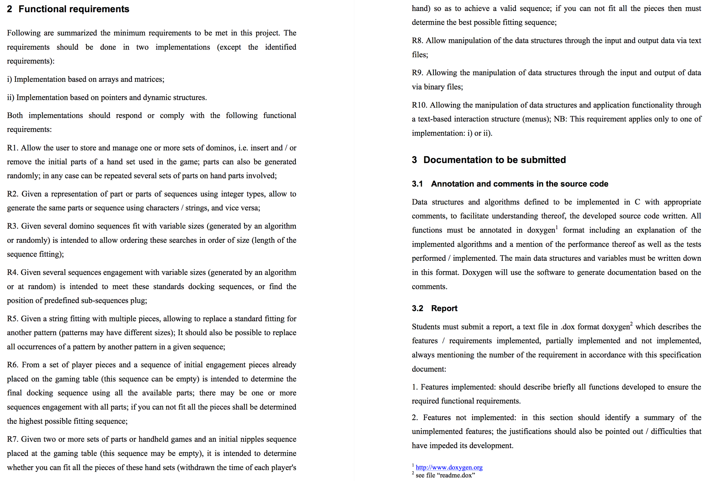

## Project Proposal
# Manipulation of arrays and dynamic data structures using the C programming language: domino case study
*Within subjects: Algorithms and Data Structures I & Programming Languages I*

October 2016

Fernando Pessoa university

Faculty of Science and Technology

Demonstration

Screenshots

#Collaborators

### Ricardo Pereira Barbosa

### Rui Miguel Martins
